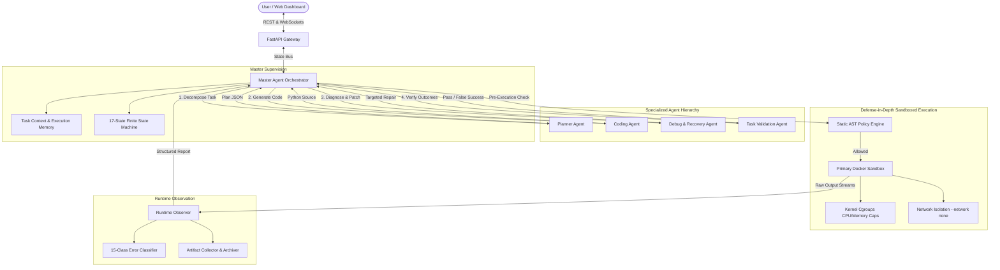

# ReRun

### Technical Title
**ReRun: A Hierarchical Autonomous Coding Agent with Runtime-Guided Recovery, Sandboxed Execution, and Task-Level Verification**

[](https://www.python.org/downloads/)
[](https://fastapi.tiangolo.com)
[](https://react.dev)
[](https://www.docker.com)
[](LICENSE)

---

## 1. Project Overview & Research Positioning

ReRun is a modular autonomous execution and recovery platform that transforms natural language tasks into verified, sandboxed execution outcomes. 

Rather than functioning as a passive chatbot or naive code generator, ReRun implements a closed-loop autonomous lifecycle:

$$\text{UNDERSTAND} \rightarrow \text{PLAN} \rightarrow \text{DELEGATE} \rightarrow \text{GENERATE} \rightarrow \text{SECURE} \rightarrow \text{EXECUTE} \rightarrow \text{OBSERVE} \rightarrow \text{DIAGNOSE} \rightarrow \text{REPAIR} \rightarrow \text{VALIDATE}$$

### What ReRun Claims:
- **Hierarchical Supervision**: A central Master Agent supervises execution states, lifecycle transitions, and stopping limits.
- **Runtime-Guided Targeted Recovery**: An empirical 15-class error taxonomy providing differentiated repairs instead of blind regeneration.
- **Execution-History-Aware Memory**: Tracks code versions, parent diffs, and repeated error signatures to prevent circular repairs.
- **Task-Level Semantic Verification**: Rigorously separates **Execution Success (Exit Code 0)** from **Task Completion** ($\text{Exit Code } 0 \neq \text{Task Success}$), detecting and resolving False Successes.
- **Defense-in-Depth Sandboxing**: Multi-layered execution security combining static AST inspection, disposable Docker containers, kernel cgroups, and network isolation (`--network none`).

### What ReRun Does NOT Claim:
- It is *not* "the first autonomous coding agent" (autonomous coding, self-debugging, and sandboxing already exist in research and industry).
- It does *not* claim "Docker makes execution completely secure" (container isolation is a mitigation layer, not a silver bullet).

---

## 2. Architecture & State Machine



### The 17-State Finite State Machine:
`RECEIVED` $\rightarrow$ `PLANNING` $\rightarrow$ `PLAN_READY` $\rightarrow$ `GENERATING` $\rightarrow$ `SECURITY_CHECK` $\rightarrow$ `EXECUTING` $\rightarrow$ `OBSERVING` $\rightarrow$ `ANALYZING_FAILURE` $\rightarrow$ `REPAIRING` $\rightarrow$ `RETRYING` $\rightarrow$ `VALIDATING` $\rightarrow$ `REPLANNING` $\rightarrow$ `COMPLETED` / `FAILED` / `BLOCKED` / `TIMEOUT` / `CANCELLED`.

---

## 3. Experimental Evaluation Results

ReRun was evaluated against standard baselines across our benchmark suite (`evaluation/benchmark_report.json`):

| System Configuration | Final Success Rate | First Attempt Success | Avg Attempts | False Success Rate |
|---|---|---|---|---|
| **Baseline A (One-Shot LLM)** | 85.7% | 85.7% | 1.00 | **14.3%** |
| **Baseline B (Simple Retry)** | 85.7% | 85.7% | 1.29 | **14.3%** |
| **ReRun (Proposed System)** | **100.0%** | 85.7% | 1.29 | **0.0%** |

- **False Success Elimination**: Baseline A and B both suffered a 14.3% false-success rate when code exited 0 without saving required deliverables. ReRun caught and repaired 100% of these cases.
- **Autonomous Recovery**: ReRun successfully recovered from injected runtime exceptions (e.g. `KeyError` in pandas columns) on Attempt 2.

---

## 4. Quickstart & Local Execution

### 1. Prerequisites
- Python 3.10+
- Node.js 18+

### 2. Backend Setup
```powershell
# Create & activate virtual environment
python -m venv .venv
.\.venv\Scripts\activate

# Install backend dependencies
pip install -r backend/requirements.txt

# Run FastAPI backend
uvicorn backend.app.main:app --port 8000 --reload
```

### 3. Frontend Setup
```powershell
cd frontend
npm install
npm run dev
```
Open `http://localhost:5173` to access the live dashboard.

### 4. Running the Test Suite
```powershell
.\.venv\Scripts\pytest backend/tests -v
```

### 5. Running the Benchmark Suite
```powershell
.\.venv\Scripts\python evaluation/runner.py
```

---

## 5. Docker Compose Deployment

```bash
# Build sandbox runner image
docker build -t rerun-sandbox:latest ./sandbox

# Launch full stack (PostgreSQL + Backend + React Frontend)
docker-compose up --build -d
```

- Frontend: `http://localhost:3000`
- Backend API Docs: `http://localhost:8000/docs`

---

## 6. Directory Structure

```text
rerun/
├── backend/
│   ├── app/
│   │   ├── api/                     # REST & WebSocket endpoints
│   │   ├── agents/
│   │   │   ├── master/              # Master Agent Orchestrator & TaskContext
│   │   │   ├── planner/             # Planner Agent (Task decomposition)
│   │   │   ├── coding/              # Coding Agent (Python generator)
│   │   │   ├── recovery/            # History-aware Debug & Recovery Agent
│   │   │   └── validator/           # Task Validation & False-Success Detector
│   │   ├── security/                # AST static policy & path traversal guard
│   │   ├── execution/               # Docker Sandbox & Dev Fallback Runner
│   │   ├── observation/             # Runtime Observer & 15-class Error Classifier
│   │   ├── llm/                     # Multi-provider LLM abstraction (Mock/OpenAI)
│   │   ├── database/                # SQLAlchemy async models & session
│   │   └── main.py                  # FastAPI entrypoint
│   └── tests/                       # Complete automated unit & integration tests
├── frontend/                        # React + Vite dashboard
├── sandbox/                         # Dockerfile & in-container watchdog runner
├── evaluation/                      # Standard benchmark tasks & baseline comparison
├── docs/                            # Comprehensive technical & research documentation
├── docker-compose.yml
└── README.md
```

---

## 7. License

Distributed under the MIT License.
