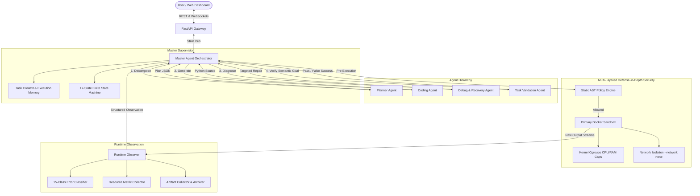

# ReRun System Architecture

## 1. Architectural Philosophy

**ReRun: A Hierarchical Autonomous Coding Agent with Runtime-Guided Recovery, Sandboxed Execution, and Task-Level Verification**

Modern Large Language Models (LLMs) can generate syntactically plausible code, but in autonomous software engineering, **code generation is only the first step**. Real-world tasks fail due to runtime exceptions, schema mismatches, resource limits, and semantic divergence between program output and user expectations.

ReRun replaces naive single-prompt code generation with an auditable, bounded, supervisory architecture:

$$\text{User Objective} \longrightarrow \text{Master Supervision} \longrightarrow \text{Planning} \longrightarrow \text{Sandboxed Execution} \longrightarrow \text{Observation} \longrightarrow \text{Recovery} \longrightarrow \text{Task Validation}$$

---

## 2. Component Topology

---

## 3. Core Subsystems

### 3.1 Master Agent Orchestrator
The Master Agent is the primary supervising intelligence. It does not write code directly; instead, it coordinates the lifecycle, tracks attempt counts, determines stopping conditions, and routes failures based on contextual history.

### 3.2 17-State Finite State Machine (FSM)
The workflow is governed by an explicit state machine with strict transition guards:
- `RECEIVED` $\rightarrow$ `PLANNING` $\rightarrow$ `PLAN_READY` $\rightarrow$ `GENERATING` $\rightarrow$ `SECURITY_CHECK` $\rightarrow$ `EXECUTING` $\rightarrow$ `OBSERVING` $\rightarrow$ `VALIDATING` $\rightarrow$ `COMPLETED`
- Exceptions route through `ANALYZING_FAILURE` $\rightarrow$ `REPAIRING` $\rightarrow$ `RETRYING` $\rightarrow$ `SECURITY_CHECK`.
- User cancellation is supported from any non-terminal state directly to `CANCELLED`.
- Policy violations halt at `BLOCKED` $\rightarrow$ `FAILED`.
- Timeouts undergo a first-class Master recovery decision (`TIMEOUT` $\rightarrow$ `REPAIRING` / `REPLANNING` / `FAILED`).

### 3.3 Task Context & Execution Memory
The Master Agent maintains an immutable audit trail of code versions (`attempt_1`, `attempt_2`, ...), diffs, execution metrics, and repeated failure signatures. The Recovery Agent consumes this context to prevent looping on identical repairs.

### 3.4 Defense-in-Depth Sandboxed Execution
Code execution is restricted across five concrete layers:
1. **Static AST Analysis**: Prohibits forbidden syscalls (`subprocess`, `os.system`, `eval`, path traversal).
2. **Container Boundary**: Isolated Docker container with `--read-only` root filesystem.
3. **Cgroups & Watchdogs**: Hard memory caps (`--memory=512m`), CPU quotas (`--cpus=1.0`), and PID limits (`--pids-limit=64`).
4. **Network Restrictions**: Container runs with `--network none` by default.
5. **Output Stream Watchdog**: Truncates stdout/stderr at 512 KB to prevent terminal flooding.

### 3.5 Task-Level Validation & False-Success Detection
Execution success (exit code 0) is fundamentally separated from task success. The validator evaluates deliverable presence, file size thresholds, and numerical calculations. Any code exiting cleanly without fulfilling deliverables is flagged as `EXECUTION_SUCCESS + TASK_FAILURE` (False Success) and routed back for repair.
