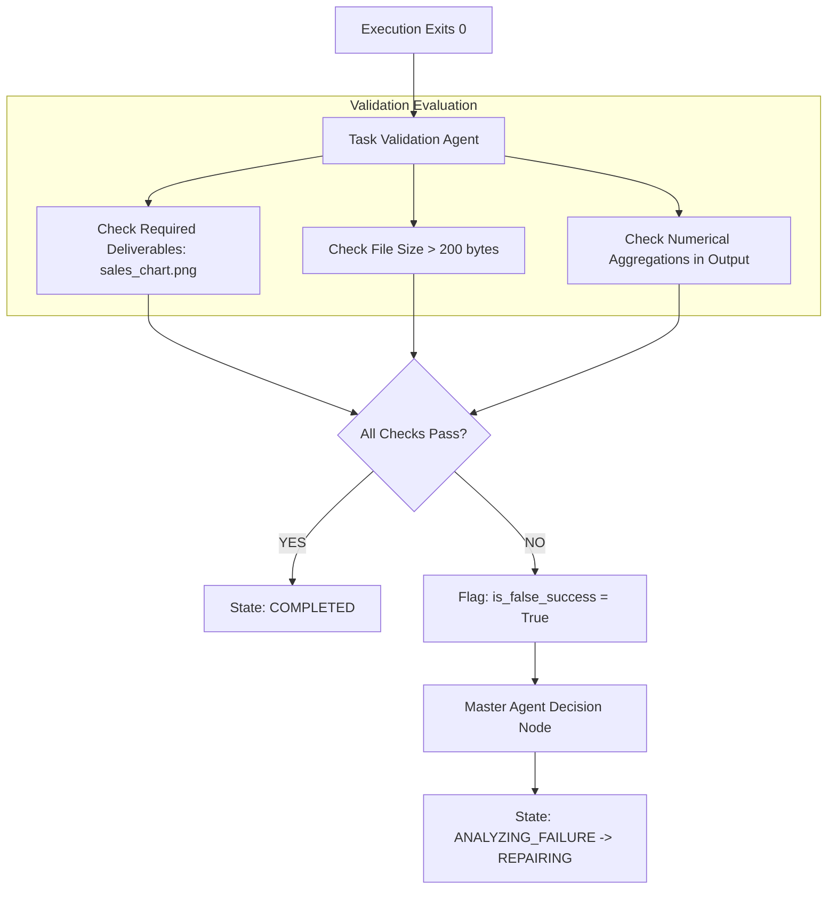

# Task-Level Semantic Validation & False-Success Detection

## 1. Core Principle: Exit Code 0 ≠ Task Success

A major vulnerability in autonomous code-generation benchmarks is the conflation of **Execution Success** with **Task Completion**.

Consider the following Python script:
```python
import pandas as pd
print("Loaded sales data successfully.")
# The user asked for a monthly revenue bar chart, but the script omitted plt.savefig()
```
- **Exit Code**: `0`
- **Stderr**: `""`
- **Naive Agent Assessment**: "Task Completed Successfully!"
- **Actual Result**: **Failure** (No chart deliverable was created).

ReRun explicitly classifies this condition as:
$$\text{EXECUTION\_SUCCESS} + \text{TASK\_FAILURE} \Longrightarrow \text{FALSE SUCCESS}$$

---

## 2. Validation Architecture



---

## 3. Semantic Verification Rules

1. **Artifact Existence Check**:
   - Compares generated workspace files against planned deliverables (`sales_chart.png`, `summary.json`, etc.).
2. **Deliverable Integrity Check**:
   - File size must exceed minimum threshold (e.g. valid PNG > 500 bytes; prevents 0-byte corrupt files).
3. **Calculation Presence Check**:
   - Validates that runtime stdout contains quantitative outputs matching requested metrics (e.g. monthly revenue totals).
4. **Scoring Function**:
   - Score $\in [0.0, 1.0]$. Each failure reduces score by $0.4$. A score of $1.0$ is required for completion.
